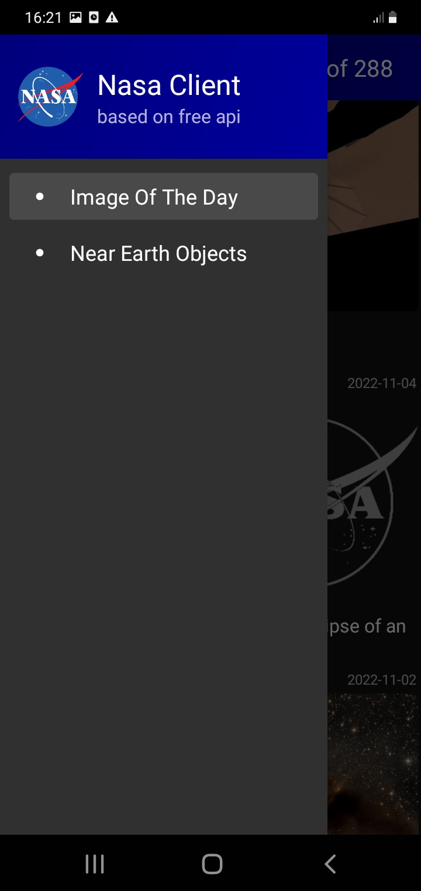
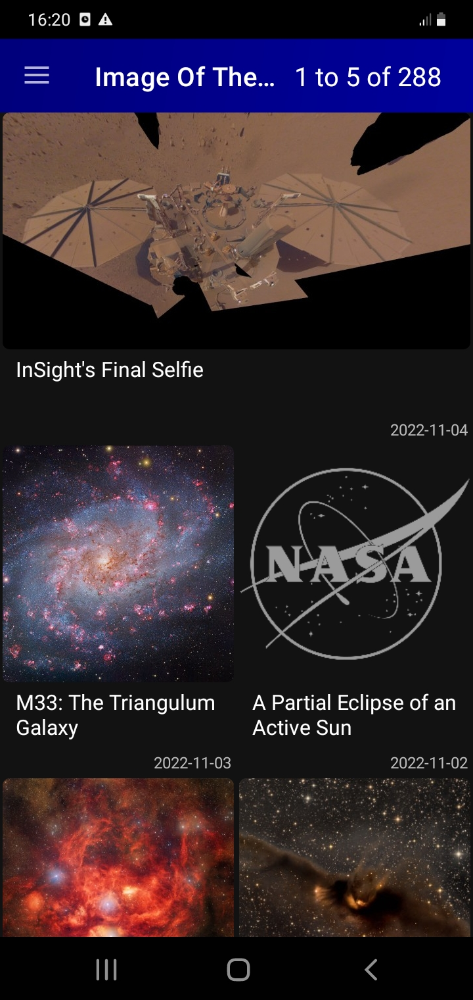

# NasaAndroidClient
## About
Based on [Free NASA API](https://api.nasa.gov/#browseAPI) demo client. Client uses APIs:
* APOD: Astronomy Picture of the Day
* Asteroids - NeoWs (Neo - Feed)

Main Menu is implemeted as Navigation Drawer and allow to switch between 2 screens:
* Apod Gallery (Image Of The Day) with 2/3/4 thumbnails per row, depending on screen size (like in a official NASA client from Google store).
* 3 pages carousel (yesterday, today, tomorrow) with list of NEO (Neat Earth Object) cards on every page. Every card could be expanded/collapsed to see detailed info.
To fetch full info about NEO "Open Neo Page" button could be clicked on every card. Detailed NEO data from [Jet Propulsion Laboratory](https://www.jpl.nasa.gov) will be loaded into appropriate screen. 

## Screenshots
<table>
  <tr>
    <th>Main Menu</th>
    <th>Image Of The Day<br/>(Dark theme)</th>
    <th>Image of The Day<br/>(Light theme)</th>
  </tr> 
  <tr>
    <td width="33%"></td>
    <td width="33%"></td>
    <td width="33%"></td>
  </tr>
  <tr>
    <th>Image of The Day<br/>(Card view mode)</th>
    <th>Near Earth Objects list</th>
    <th>NEO detailed<br/>(Web page)</th>
  </tr>
  <tr>
    <td width="33%"></td>
    <td width="33%"></td>
    <td width="33%"></td>
  </tr>
</table>

## Getting Started
NasaAndroidClient supports Android 9 and higher devices (Min SDK version is 28).

To increase Daily Limit from 50 requests (per IP address per day) just replace key from [Source](https://github.com/AGDemidov/NasaAndroidClient/blob/master/app/src/main/java/com/agdemidov/nasaclient/utils/Constants.kt)
```
const val NASA_API_KEY = "DEMO_KEY" 
```
with your own API key. See [Generate API Key](https://api.nasa.gov/#signUp)

## Highlights
* Implemented architecture with 3 basic levels: UI(Fragments/ViewModels), Services, Data (Repositories/HttpClient).
Middle level (services) use Data Mappers to convert DTO (Data transfer objects) from http responses to DomainModel objects for UI representation.
* ViewModels use reactive streams "SharedFlow" and observable data holder classes "LiveData".
* [Glide](https://github.com/bumptech/glide) is used for images downloading for APOD Gallery(Image Of The Day)
* Pagination is supported for APOD Gallery. If user is at the bottom of the APOD Gallery, then new portion of items is fetched from server automatically.
* Room Database is used for caching APOD Gallery screen data.
* SharedPrefernces are used for caching Neo screen data.
* [Retrofit 2](http://square.github.io/retrofit/) is used for network request.
* ViewPager2 and RecyclerView widgets are used for UI.
* White/Black themes are supported.
	
## ToDo List
- to add Dagger 2 for DI
